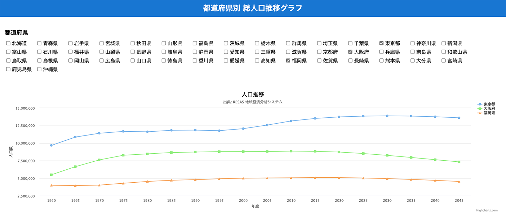

# Population Trend



都道府県別の総人口推移グラフを表示する SPA

## 環境

- React: 17.0.2
- Next.js: 11.1.2
- TypeScript: 4.4.3
- Node.js: 16.11.0
- styled-components: 5.3.1
- Axios: 0.22.0
- Highcharts: 9.2.2

## 構成

ディレクトリ|機能
:--:|:--:
@types|型の定義
components|UI コンポーネントの定義
pages/api|API との接続
pages|components の組み立て
styles|グローバル CSS の定義
test|API 取得のテスト

## 手順

1. [RESAS-API](https://opendata.resas-portal.go.jp/) から API Key を取得する
2. ```.env.local``` ファイルを作成し、取得した API Key を  ```RESAS_API_KEY``` に代入する（```.env.local.sample``` 参照）
3. ```yarn dev``` or ```npm run dev``` で [http://localhost:3000](http://localhost:3000) を開く

## 参考

\*RESAS-API: https://opendata.resas-portal.go.jp/

\*RESAS-API 仕様書: https://opendata.resas-portal.go.jp/docs/api/v1/index.html

\*Highcharts: https://www.highcharts.com/